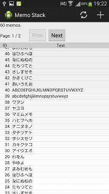

Memo Stack (Android)
====================

画面写真
--------

doc/screenshots 以下に画面写真があります。

キーワード
----------

* Android
* Volley
* フラグメント
    * UIなしフラグメント
* リフレクション(Java)

概要
----

サーバー(__Rails__)とクライアント(__Android__)の連携の習作です。  
通信ライブラリは Google の Volley を使いました。  

`MainActivity` が肥大化しないように、`Fragment` に分割して整理しながらプログラミングを進めました。
Fragment 同士で直接やりとりせずに、MainActivity が適切に仲介します。  

コピペが氾濫しないようにメタプログラミングをしています。
メタプログラミングに凝り過ぎると逆に可読性が落ちると思われる箇所では、素直にコピペもします。

アプリについて
--------------

* シンプルなテキストメモの投稿/閲覧/削除サービスのクライアントです。
* `index`, `new/create`, `show`, `destroy` がありますが、`edit/update` がありません。
* エラーは ErrorListFragment に蓄積されていきます。
    * エラーが追加されると、ActionBar にエラーアイコンが出現します。
    * エラーアイコンをタップすると、エラーをリスト表示する画面に遷移します。
* メイン画面はメモの一覧のリスト表示です。
* リスト表示からメモをタップすると、その詳細を表示する画面に遷移します。
    * 詳細表示画面で Delete ボタンを押下すると、そのメモを消去します。
* ActionBar にある新規作成アイコンを押下すると、新規作成画面に遷移します。

工夫したこと
------------

* 接続先アドレスは、`SharedPreferences` で設定/保存しました。
* フラグメント毎に ActionBar のアイコンを切り替えました。
    * たとえば、ErrorListFragment には新規作成アイコンがありません。
* 各フラグメントは１つしかインスタンスを持たないので、インスタンスに付与するタグはそのクラス名にするという単純な規約にしました。
* 各フラグメントは、MainActivity にアタッチされているが__ビューツリー__からは削除されている状態がほとんどです。
    * ビューツリーにぶら下げたり取り外したりすることで、フラグメントの表示を切り替えています。
* Poppable という__マーカーインターフェース__によって、BackStack に追加すべきか否かをフラグメント自身に尋ねることができます。
    * 画面遷移のシナリオを MainActivity が全て把握しなくて済みます。
    * これで端末の BACK キー押下に対応しました。
* MainActivity は各フラグメントを管理/仲介しますが、通信処理もしなければデータ管理もしません。
    * VolleyWorkerFragment は通信処理をしますが、受信データは管理しません。
      * VolleyWorkerFragment は UI を持たないフラグメントです。
    * 受信データは、VolleyWorkerFragment から MainActivity に渡されて、MainActivity から MemoListFragment や MemoShowFragment などに渡されます。
    * 最終的に渡された先のフラグメントがデータを管理します。

謝辞
----

ありがとうございます。

Downloads | Android Developers  
http://developer.android.com/design/downloads/index.html

Support Library | Android Developers  
http://developer.android.com/tools/support-library/index.html

platform/frameworks/volley - Git at Google  
https://android.googlesource.com/platform/frameworks/volley/

動作確認
--------

* Mac OS X 10.8.5
* Eclipse Kepler Service Release 2
* Intel x86 Emulator Accelerator Rev.4
* 実機 Galaxy S3α (Android 4.3)

- - - - - - - - - - - - - - - - - - - -
Author: 村上悌治(Teiji MURAKAMI)  
GitHub: https://github.com/murakamit/memo-stack-android
